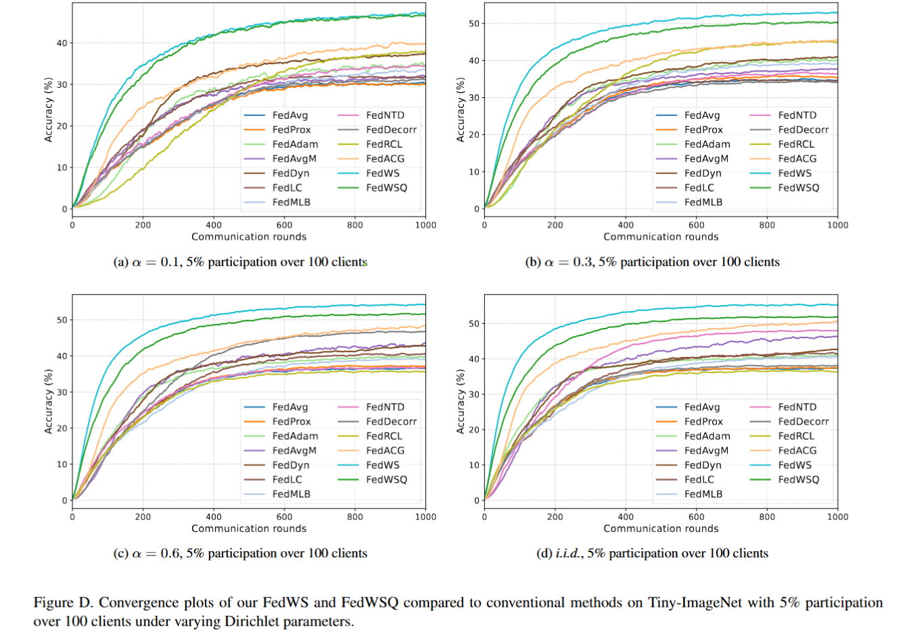

# FedWSQ: Efficient Federated Learning with WS and DANUQ


This repository is the official implementation of *[ICCV 2025](https://iccv.thecvf.com/)* paper ***["FedWSQ: Efficient Federated Learning with Weight Standardization and Distribution-Aware Non-Uniform Quantization"]()***

By [Seung-Wook Kim](https://www.linkedin.com/in/%EC%8A%B9%EC%9A%B1-%EA%B9%80-003a7310a/), [Seong-yeol Kim](https://github.com/Seongyeol-kim), [Jiah Kim](https://github.com/Kim-Jiah), [Seowon Ji](https://www.linkedin.com/in/seowon-ji-7587741a9/) and [Se-Ho Lee](https://dblp.org/pid/158/9405.html)




> Federated learning (FL) often suffers from performance degradation due to key challenges such as data heterogeneity and communication constraints.
To address these limitations, we present a novel FL framework called FedWSQ, which integrates weight standardization~(WS) and the proposed distribution-aware non-uniform quantization~(DANUQ).
WS enhances FL performance by filtering out biased components in local updates during training, thereby improving the robustness of the model against data heterogeneity and unstable client participation. In addition, DANUQ minimizes quantization errors by leveraging the statistical properties of local model updates. As a result, FedWSQ significantly reduces communication overhead while maintaining superior model accuracy.
Extensive experiments on FL benchmark datasets demonstrate that FedWSQ consistently outperforms existing FL methods across various challenging FL settings, including extreme data heterogeneity and ultra-low-bit communication scenarios. 

## Installation
### ⚙ Dependencies

[](https://ubuntu.com/download)
[](https://www.anaconda.com/download)
[](https://pytorch.org/)
[](https://developer.nvidia.com/cuda-downloads)

We have exported all required dependencies into `fedwsq.yaml`.  
You can create the environment by running:

```
git clone https://github.com/gymlab/FedWSQ.git
conda env create -f fedwsq.yaml
conda activate fedwsq
```


### 🗂 Dataset

CIFAR-10 and CIFAR-100 will be downloaded automatically.  
Only Tiny-ImageNet requires manual download.:
- [CIFAR-10 & CIFAR-100](https://www.cs.toronto.edu/~kriz/cifar.html)
- [Tiny-ImageNet](https://www.image-net.org/index.php)

  

### 🛠️ Arguments
The following `arguments` can be adjusted to customize experiments (**default is bold**):

| Argument                       | Options                                                     |
|--------------------------------|-------------------------------------------------------------|
| `--dataset`                    | **`cifar10`** , `cifar100`, `tinyimagenet`                  |
| `--batch_size`                 | **`50`** , `100`, `...`                                     |
| `--quantizer.wt_bit`           | `1`, **`4`**, `...`                                         |
| `--quantizer.random_bit`       | **`none`** , `fixed_alloc` , `rand_alloc`                   |
| `--trainer.num_clients`        | **`100`** , `500` , `...`                                   |
| `--trainer.participation_rate` | `0.02`, **`0.05`**, `...`                                   |
| `--split.mode`                 | **`dirichlet`**, `iid`                                      |
| `--split.alpha`                | `0.03`, `0.05`, `0.1`, **`0.3`** , `0.6`, `...`             |

**⚠️ Note**
- **Batch Size Defaults:** `--batch_size=50` for CIFAR datasets, `--batch_size=100` for Tiny-ImageNet.
- To enable **Fixed-Bit Allocation (FBA)**, set `--quantizer.random_bit=fixed_alloc`.
- To enable **Dynamic-Bit Allocation (DBA)**, set `--quantizer.random_bit=rand_alloc`.
- When `--quantizer.random_bit=none`, `--quantizer.wt_bit` is ignored.
- When `--split.mode=iid`, `--split.alpha` is ignored.
 
### 📌 Quick Start
> CIFAR-10, 4bits, 100 clients, 5% participation, Dirichlet (0.3) split (**default**)  
```
python3 federated_train.py visible_devices="0" client=base server=base dataset=cifar10 batch_size=50 quantizer=WSQLG quantizer.wt_bit=4 quantizer.random_bit=none trainer.num_clients=100 trainer.participation_rate=0.05 split.mode=dirichlet split.alpha=0.3
```

> CIFAR-10, FBA(2.33bits), 100 clients, 5% participation, Dirichlet (0.1) split
```
python3 federated_train.py visible_devices="0" client=base server=base dataset=cifar10 batch_size=50 quantizer=WSQLG quantizer.random_bit=fixed_alloc trainer.num_clients=100 trainer.participation_rate=0.05 split.mode=dirichlet split.alpha=0.1
```

> CIFAR-100, DBA(2.33bits), 500 clients, 2% participation, Dirichlet (0.3) split
```
python3 federated_train.py visible_devices="0" client=base server=base dataset=cifar10 batch_size=50 quantizer=WSQLG quantizer.random_bit=rand_alloc trainer.num_clients=500 trainer.participation_rate=0.02 split.mode=dirichlet split.alpha=0.3
```

> Tiny-ImageNet, 1bits, 100 clients, 5% participation, iid split
```
python3 federated_train.py visible_devices="0" client=base server=base dataset=tinyimagenet batch_size=100 quantizer=WSQLG quantizer.wt_bit=4 quantizer.random_bit=none trainer.num_clients=100 trainer.participation_rate=0.05 split.mode=iid
```

## References
### 📚 Citation

If you find this work useful for your research, please cite our paper:

```
@inproceedings{kim2025Efficient,
  author    = {Kim, Seung-Wook and Kim, Seong-Yeol and Kim, Jiah and Ji, Seowon and Lee, Se-Ho},
  title     = {Efficient Federated Learning with Weight Standardization and Distribution-Aware Non-Uniform Quantization},
  booktitle = {ICCV},
  year      = {2025},
}
```

### 🙏 Acknowledgement

This code is built on [FedACG](https://github.com/geehokim/FedACG). Thanks to the authors for their great contribution!


